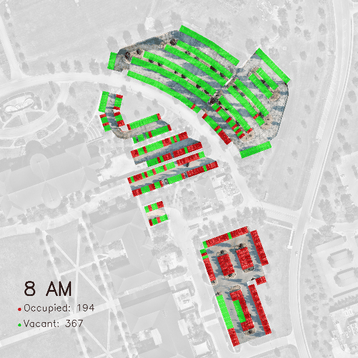
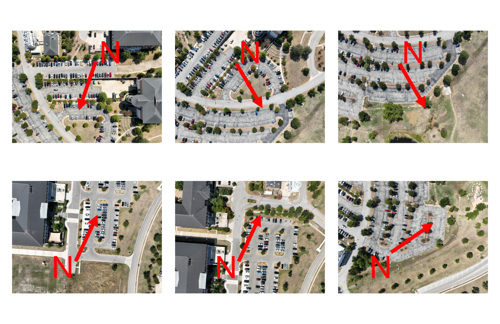

# PARKING OCCUPANCY ANALYSIS

Monitor and analyze parking occupancy at scale using drones and AI

#### 1. Collect drone images

#### 2. Collect high-resolution satellite imagery

#### 3. Feature detection and descriptor matching

#### 4. Apply RANSAC to filter outliers and compute homography matrix

#### 5. Warp transform

#### 6. Overlay drone images onto satellite imagery 
  

#### 7. Perform car detection

#### 7. Apply binary mask image

#### 8. Label occupancy status for each parking stall 

  
  
