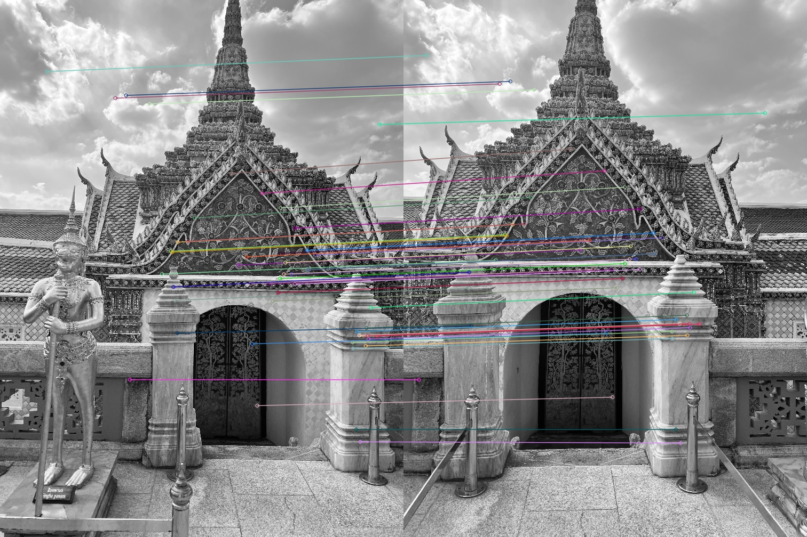
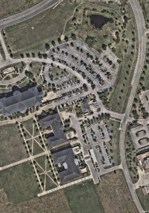
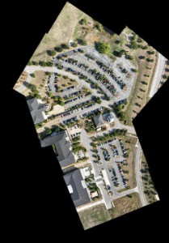
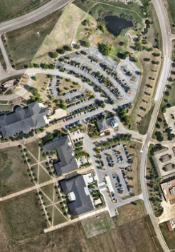

# Computer Vision Projects
Learning by doing. This repo represents my journey of learning CV and will contain a variety of small-scale projects, from classic to CNN.  

### 1. Object Tracking
    
- Optical flow - Parking lot tracking

- Optical flow - Vehicle tracking

[**Repo**](1-object-tracking/optical-flow) | [**README**](1-object-tracking/optical-flow/README.md) | [**Demo**](https://www.youtube.com/watch?v=uecvioD0xVw)

#### Acknowledgement 

    The car detection model was trained on the pretrained YOLOv8 model developed by Ultralytics.
    https://github.com/ultralytics/ultralytics 

    The segementation model, Segment-Anything, was developed by Meta AI.
    https://github.com/facebookresearch/segment-anything 

### 2. Feature Detection

- Feature matching

- Stitch and map drone images onto satellite imagery

    

         
        Satellite
    

    

         
        Stitched
    

    

         
        Overlay
    

[**Repo**](2-feature-detection) | [**README**](2-feature-detection/README.md) 

