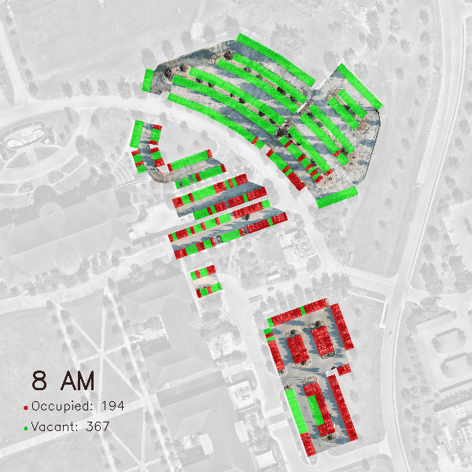
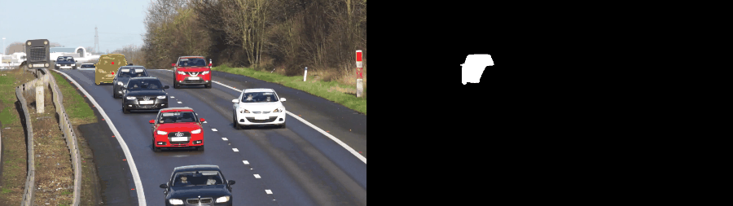
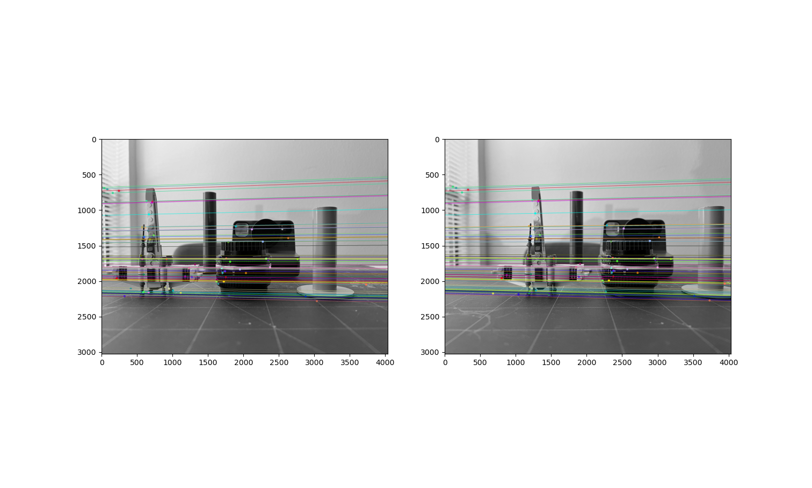

# Computer Vision Projects
Learning by doing. This repo represents my journey of learning CV and will contain a variety of small-scale projects, from classic to CNN.  

### 0. Capstone project

- Monitor and analyze parking occupancy at scale using drones and AI

Techniques: 

    - Feature detection and descriptor matching
    - RANSAC
    - Homography matrix 
    - GIS
    - Object detection
    - Perspective transform
    
[**README**](0_capstone/parking_occupancy_monitoring/README.md) 

### 1. Object Tracking

- Kalman Filter - Multi-object tracking and tag them with an ID

- Optical flow - Parking lot tracking

- Optical flow - Vehicle tracking

[**Repo**](1_object_tracking/optical_flow) | [**README**](1_object_tracking/optical_flow/README.md) | [**Demo**](https://www.youtube.com/watch?v=uecvioD0xVw)

#### Acknowledgement 

    The car detection model was trained on the pretrained YOLOv8 model developed by Ultralytics.
    https://github.com/ultralytics/ultralytics 

    The segementation model, Segment-Anything, was developed by Meta AI.
    https://github.com/facebookresearch/segment-anything 

### 2. Feature Detection

- Feature matching

- Feature matching + Homography - Stitch and map drone images onto satellite imagery

  

[**Repo**](2_feature_detection) | [**README**](2_feature_detection/README.md) 

### 3. Stereo Vision

- Epipolar lines

- Depth map

[**Repo**](3_stereo_vision) | 

